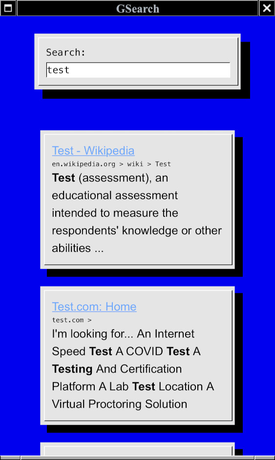

# gsearch
Google CSE Wrapper




# deploy

### Build the docker container

```
docker build -t py:gsearch .
```

### Run server (interactive)

```
docker run -it --rm -p 8080:8080 -v $PWD/config:/app/config --name gsearch py:gsearch
```

### Run server (background)

```
docker run -d  --restart unless-stopped -p 8080:8080 -v $PWD/config:/app/config --name gsearch py:gsearch
```